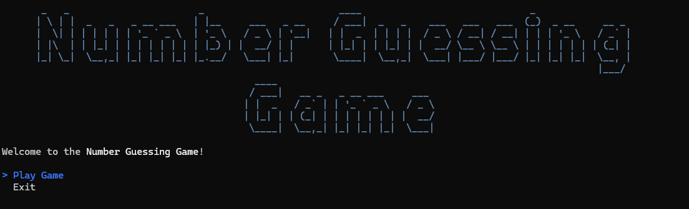
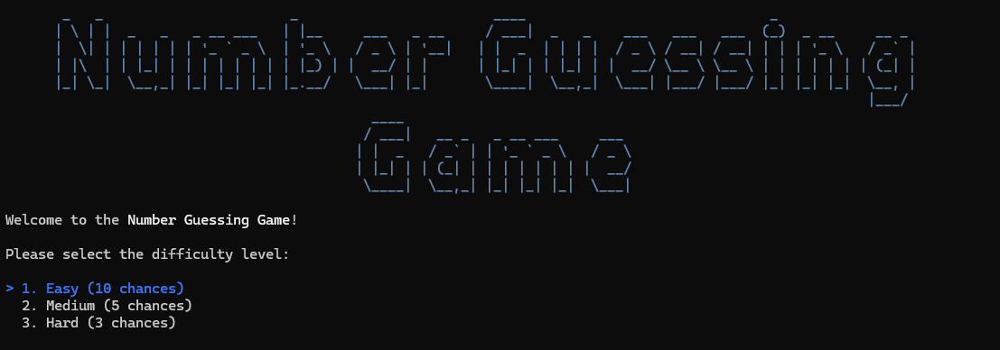
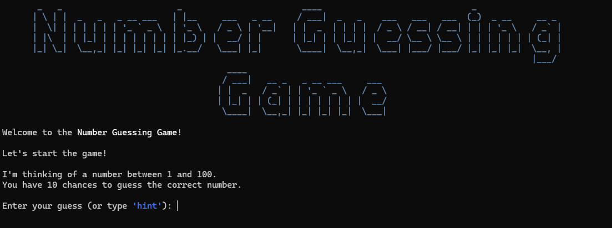
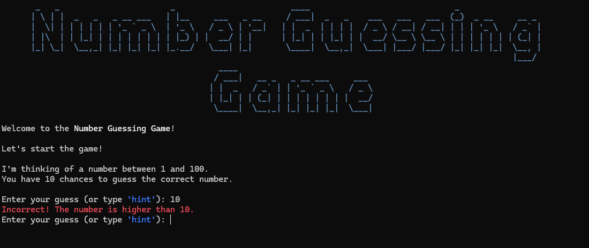
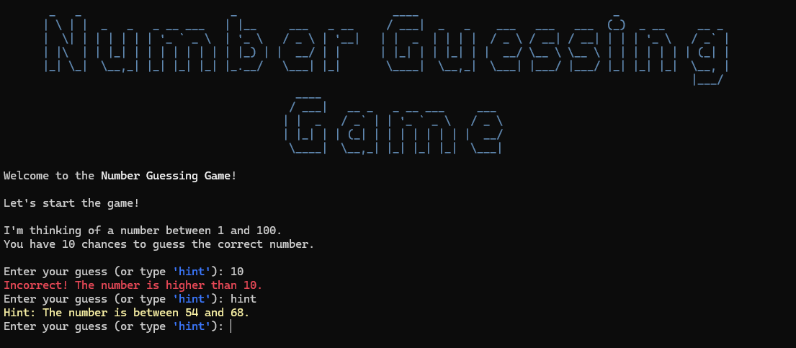
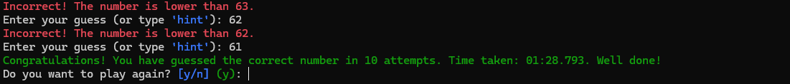

# 🎯 Number Guessing Game


This project is a learning exercise based on the [Number Guessing Game project](https://roadmap.sh/projects/number-guessing-game) from [roadmap.sh](https://roadmap.sh/). It’s a fun, terminal-based number guessing game built with C#. Choose your difficulty, guess the number, ask for hints, and try to beat the high score!

## 🕹️ Features

- 🎮 Play multiple rounds with difficulty selection
- ⏱️ Built-in timer to measure how fast you solve each game
- 🧠 Smart **hint system** with randomized ranges
- 🏆 High score tracking (based on attempts)
- 📜 Clean console UI with [Spectre.Console](https://github.com/spectreconsole/spectre.console)
- ✅ Fully tested core engine using xUnit and NSubstitute
- 🔌 Dependency Injection for flexible and testable architecture

## 📦 Project Structure

```
NumberGuessingGame/
├── Core/              # Game logic (GameEngine, Enums, Interfaces)
├── Data/              # High score data storage
├── UI/                # Spectre.Console based user interface
├── Tests/             # Unit tests using xUnit + NSubstitute
├── Program.cs         # Entry point
└── README.md
```

## 🚀 Getting Started

### Prerequisites

- [.NET 9.0 SDK](https://dotnet.microsoft.com/en-us/download/dotnet/9.0)

### Run the Game

```bash
dotnet run --project NumberGuessingGame
```

### Run the Tests

```bash
dotnet test
```

## 🤓 Example Gameplay








## 📌 TODO / Ideas

- [ ] Leaderboard for multiple high scores
- [ ] Limit number of hints per round
- [ ] Save/load game state
- [ ] Web version?
